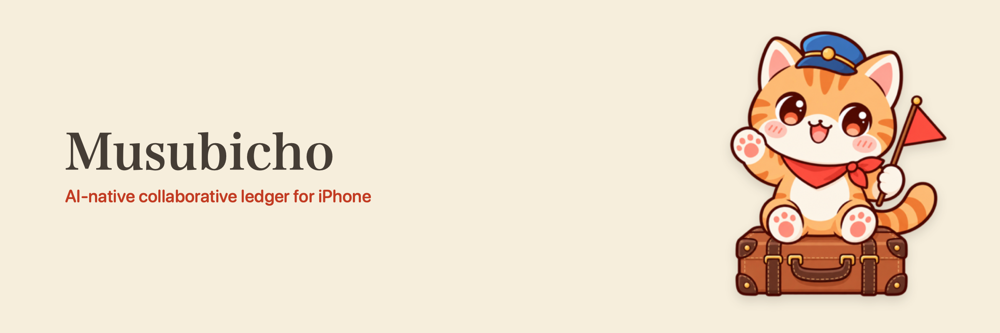

<picture>
  <source media="(prefers-color-scheme: dark)" srcset="./banner-dark.png">
  
</picture>

**An AI travel metaverse for iPhone.** A trip is a world you share: the days, the places, the people, and the money. Tell Musubi what happened, or show a photo, and that world updates around you.

- **One trip, one world** — plans, the journey, the map, and the money stay together.
- **Agent first** — describe it, photograph it, correct it in conversation.
- **The days** — flights, stays, meals, and places you want to go, from the first morning to the last night.
- **The places** — every plan and expense pinned where it happened.
- **The money** — receipts, fair splits, any currency, settled with the people who were there.
- **Local first** — the trip lives on your device; the cloud syncs it.

Musubi is the companion in that world. Built with UIKit and SwiftUI for iOS 26.

---

**iPhone のための AI 旅行メタバース。** 旅行は、みんなで共有する一つの世界です。日程、場所、仲間、そしてお金。むすびに話しかけるか、写真を見せれば、その世界が更新されます。

- **一つの旅行、一つの世界** — 予定、旅程、地図、お金が同じ場所にある
- **話しかければいい** — 起きたことを話す、写真を撮る、会話の中で直す
- **日程** — フライト、宿、食事、行きたい場所を、最初の朝から最後の夜まで
- **場所** — 予定も支出も、それが起きた場所に残る
- **お金** — レシートを読み、公平に割り、どの通貨でも精算する
- **ローカルファースト** — 旅行は端末の中にあり、クラウドは同期するだけ

その世界にいる相棒が、むすびです。UIKit と SwiftUI で、iOS 26 向けに作っています。
